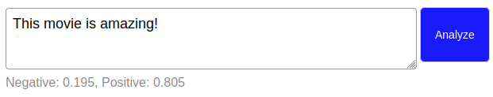

# Portfolio  
---
### Deploying NGINX to Google Cloud with Google Kubernetes Engine and Terraform  

---
### Serving a TensorFlow model with Flask and Heroku 
 

I deployed a pretrained TensorFlow Lite model to the browser using TensorFlow.js, Flask, and Heroku.

 

---
### Buttons

---

Powered by Jekyll and the Minimal Theme.

